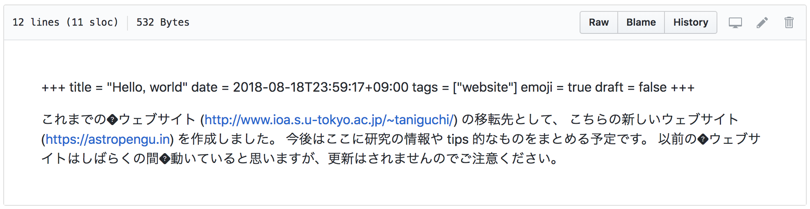

+++
title = "VS Code の日本語入力で制御文字が紛れ込む問題"
date  = 2018-12-01T18:38:39+09:00
tags  = ["VS Code"]
categories = ["Tech"]
toc = true
aliases = ["/blog/2/"]
+++

## Issue

VS Code で日本語入力して GitHub にプッシュしたら、以下のように � で表示される文字が紛れ込んでいた。
これは VS Code で使われている Electron のバグで、制御文字 (backspace) が紛れ込んでしまっているようだ。



## Solution

まず、制御文字が VS Code のエディタ上で表示されるように、 User Settings で以下を設定する。

```json
{
    "editor.renderControlCharacters": true
}
```

さらに、VS Code の拡張機能 [Remove backspace control character](https://marketplace.visualstudio.com/items?itemName=satokaz.vscode-bs-ctrlchar-remover) をインストールすることによって、
万一制御文字が紛れ込んだ場合も保存時に自動的に削除されるようにしておく。
例えば、ファイルの保存時に削除するのであれば、以下のように設定しておけば良い。

```json
{
    "editor.formatOnSave": true
}
```

## References

+ [Visual Studio Code の日本語問題まとめ - Qiita](https://qiita.com/EbXpJ6bp/items/e6a0ed52bdcb60bfd145)
+ [Visual Studio Code で制御文字が混ざる問題 - kawaken's blog](http://kawaken.hateblo.jp/entry/2018/04/02/234339)
+ [Remove backspace control character - Visual Studio Marketplace](https://marketplace.visualstudio.com/items?itemName=satokaz.vscode-bs-ctrlchar-remover)
